# Document Generation Flow: From Query to Comprehensive Research Report

## Enhanced Agent Workflow



*The enhanced agent workflow includes intelligent content enhancement and a two-tier evaluation system, ensuring comprehensive research quality.*

## Overview

The LangGraph-based research agent is a sophisticated multi-step system designed to transform simple user queries into comprehensive, well-structured research reports. This document provides an in-depth analysis of how the system coordinates multiple AI agents, manages complex state transitions, and ensures the generation of detailed, factually accurate documents.

### Core Objectives

The primary goals of this agent are to address the limitations of traditional single-prompt AI interactions by:

1. **Breaking down complex research tasks** into manageable, focused subtasks
2. **Conducting iterative research** with reflection and improvement cycles
3. **Maintaining contextual consistency** across multiple research phases
4. **Generating comprehensive reports** that fully utilize modern LLM context windows
5. **Ensuring factual accuracy** through proper citation and source management using real, accessible URLs
6. **Tracking task-specific results** for detailed content synthesis
7. **Implementing two-tier content enhancement** to ensure comprehensive information coverage

### System Architecture Philosophy No A2A for now

The agent follows a **multi-agent orchestration pattern** where specialized nodes handle specific aspects of the research pipeline:

- **Planning Agent**: Breaks down user queries into structured research plans
- **Query Generator**: Creates targeted search queries for specific research objectives
- **Web Research Agent**: Performs searches and synthesizes findings relevant to the task
- **Reflection Agent**: Evaluates research completeness and identifies gaps
- **Task Coordinator**: Manages multi-task workflows and state transitions
- **Report-Level Enhancer**: Performs targeted deep enhancement for identified information gaps
- **Document Synthesizer**: Generates the final comprehensive report with batch processing and real citation URLs

## Architecture & Design Principles

### LangGraph State Management

The system leverages LangGraph's sophisticated state management capabilities to maintain context across multiple execution phases. The state pattern design supports comprehensive task tracking and result organization:

```python
class OverallState(TypedDict):
    messages: Annotated[list, add_messages]
    user_query: str
    plan: list  # Stores task plans generated by planner_node
    current_task_pointer: int  # Points to current task in the plan
    executed_search_queries: Annotated[list, operator.add]
    web_research_result: Annotated[list, operator.add]
    sources_gathered: Annotated[list, operator.add]
    initial_search_query_count: int
    max_research_loops: int
    research_loop_count: int
    reasoning_model: str
    
    # Multi-task iteration support
    ledger: Annotated[List[LedgerEntry], operator.add]
    global_summary_memory: Annotated[List[str], operator.add]
    
    # Enhanced result tracking
    current_task_detailed_findings: Annotated[List[Dict[str, Any]], operator.add]
    task_specific_results: Annotated[List[Dict[str, Any]], operator.add]  # New: Task-associated results
    final_report_markdown: Optional[str]
```

This design ensures:
- **State Persistence**: Critical information is maintained across node transitions
- **Task Association**: Research results are properly linked to their initiating tasks
- **Parallel Execution**: Multiple research queries can be processed simultaneously
- **Incremental Building**: Results accumulate progressively through the pipeline
- **Context Preservation**: Early findings inform subsequent research decisions

### Key State Management Fixes

Recent improvements to the system have addressed critical state propagation issues:

1. **Task ID Propagation**: Added `current_task_id` field to `WebSearchState` to ensure proper task association
2. **State Continuity**: Added `plan` and `current_task_pointer` fields to intermediate states
3. **Result Organization**: Introduced `task_specific_results` for organized content tracking
4. **Error Recovery**: Enhanced error handling to maintain task association during failures

### Modular Node Design

Each node in the graph has a specific purpose and can be optimized independently:

1. **Single Responsibility**: Each node has one primary function
2. **Clear Interfaces**: Standardized input/output contracts between nodes
3. **Error Isolation**: Failure in one node doesn't cascade through the system
4. **Configurable Behavior**: Runtime configuration allows for different execution strategies

### Prompt Engineering Architecture

The system employs sophisticated prompt engineering strategies including:

- **Role-based Instructions**: Each agent has clearly defined roles and behavioral guidelines
- **Structured Output Requirements**: JSON schemas ensure consistent data exchange
- **Context-aware Prompts**: Prompts adapt based on current research state
- **Example-driven Learning**: Prompts include relevant examples to guide LLM behavior

## State Management

### State Evolution Through the Pipeline

The system's state undergoes systematic transformations as it progresses through different phases:

#### Initial State (User Query Input)
```json
{
  "messages": [{"role": "user", "content": "Research question here"}],
  "user_query": "Research question here",
  "plan": [],
  "current_task_pointer": 0
}
```

#### Planning Phase State
```json
{
  "user_query": "Research question here",
  "plan": [
    {
      "id": "task-1",
      "description": "Specific research objective",
      "info_needed": true,
      "source_hint": "Search keywords",
      "status": "pending"
    }
  ],
  "current_task_pointer": 0
}
```

#### Research Execution State
```json
{
  "query_list": ["Search query 1", "Search query 2"],
  "web_research_result": ["Detailed finding 1", "Detailed finding 2"],
  "task_specific_results": [
    {
      "task_id": "task-1",
      "content": "Research content",
      "sources": ["url1", "url2"],
      "timestamp": "2024-01-01T12:00:00"
    }
  ]
}
```

#### Final Report State
```json
{
  "ledger": [
    {
      "task_id": "task-1",
      "findings_summary": "Key findings summary",
      "detailed_snippets": ["Detailed content"],
      "citations_for_snippets": [{"snippet": "Content", "source": "url"}]
    }
  ],
  "final_report_markdown": "Complete markdown report"
}
```

### State Validation and Integrity

The system implements several mechanisms to ensure state integrity:

1. **Type Safety**: TypedDict definitions prevent invalid state changes
2. **Validation Checks**: Each node validates its required inputs before processing
3. **Fallback Mechanisms**: Default values and error recovery prevent system failure
4. **State Logging**: Comprehensive logging tracks state evolution for debugging

## Node-by-Node Analysis

### 1. Planning Node

The planning node serves as the strategic intelligence of the system, transforming unstructured user queries into executable research plans.

#### Functional Overview

The planner employs advanced prompt engineering to:
- Analyze query intent and scope
- Identify key research dimensions
- Generate structured, sequential tasks
- Provide search hints per task

#### Prompt Design Strategy

Structured to maximize LLM reasoning:

```markdown
You are a **PlannerAgent** transforming queries into research plans.

=== Output Format ===
Return JSON array with specific fields...

=== Requirements ===
1. Analyze query and identify objectives
2. Request clarification if needed
3. Create logical multi-step plan
```

#### Implementation Highlights

- **Structured Output**: Uses LangChain's `with_structured_output`
- **Error Handling**: Falls back to simple plan on failure
- **Query Analysis**: Prioritizes explicit queries with history fallback

#### Quality Factors

1. Scope decomposition
2. Logical task ordering  
3. Search optimization
4. Topic coverage

### 2. Query Generation Node

Converts research objectives into targeted search queries with task tracking.

#### Query Strategies

1. **Diversity**: Multiple query angles
2. **Specificity**: Balanced precision
3. **Timeliness**: Date awareness
4. **Source Variety**: Different result types
5. **Task Alignment**: Matches research phase

#### State Management

Key fixes for state propagation:

```python
def generate_query(state: OverallState, config: RunnableConfig):
    plan = state.get("plan")
    pointer = state.get("current_task_pointer")
    if plan and pointer < len(plan):
        topic = plan[pointer]["description"]
    else:
        topic = state.get("user_query") or get_research_topic(state["messages"])
    
    result = structured_llm.invoke(prompt)
    
    return {
        "query_list": result.query,
        "plan": state.get("plan", []),
        "current_task_pointer": state.get("current_task_pointer", 0)
    }
```

#### Query Generation Prompts

Prompts guide the query generation process:

```markdown
You are a **QueryGenerator** creating web search queries.

=== Requirements ===
1. Each query should target one specific aspect
2. Queries should be diverse and complementary
3. Maximum of {number_queries} queries
4. Ensure queries are current
5. Avoid redundant or overly similar queries
```

#### Task-Query Association

The `continue_to_web_research` function maintains task-query relationships:

```python
def continue_to_web_research(state: QueryGenerationState):
    plan = state.get("plan", [])
    current_pointer = state.get("current_task_pointer", 0)
    current_task_id = "unknown"
    
    if plan and current_pointer < len(plan):
        current_task_id = plan[current_pointer]["id"]
    
    return [
        Send("web_research", {
            "search_query": search_query, 
            "id": int(idx),
            "current_task_id": current_task_id
        })
        for idx, search_query in enumerate(state["query_list"])
    ]
```

### 3. Web Research Node

The web research node interfaces with external knowledge sources using Google's search API.

#### Research Process

1. **Google Search Integration**: Uses Google's GenAI client
2. **Metadata Processing**: Extracts source attribution
3. **URL Handling**: Converts results to reference format
4. **Content Synthesis**: Combines findings coherently

#### Source Management

Implements sophisticated source tracking:

```python
resolved_urls = resolve_urls(
    response.candidates[0].grounding_metadata.grounding_chunks, 
    state["id"]
)
citations = get_citations(response, resolved_urls)
modified_text = insert_citation_markers(response.text, citations)
```

This ensures:
- **Accurate Attribution**: Claims link to sources
- **URL Preservation**: Original URLs are maintained
- **Citation Integration**: Sources are embedded in text

#### Error Handling

Robust error handling maintains task context:

```python
def web_research(state: WebSearchState, config: RunnableConfig) -> OverallState:
    try:
        response = genai_client.models.generate_content(...)
        current_task_id = state.get("current_task_id", "unknown")
        
        detailed_finding = {
            "task_id": current_task_id,
            "query_id": state["id"],
            "content": modified_text,
            "source": sources_gathered[0] if sources_gathered else None,
            "timestamp": datetime.now().isoformat()
        }
        
        return {
            "sources_gathered": sources_gathered,
            "executed_search_queries": [state["search_query"]],
            "web_research_result": [modified_text],
            "current_task_detailed_findings": [detailed_finding],
            "task_specific_results": [{
                "task_id": current_task_id,
                "content": modified_text,
                "sources": sources_gathered,
                "timestamp": datetime.now().isoformat()
            }]
        }
    
    except Exception as e:
        # Maintain task context in errors
        return {
            "sources_gathered": [],
            "web_research_result": [f"Research error: {str(e)}"],
            "current_task_detailed_findings": [],
            "task_specific_results": []
        }
```

## Data Flow & Transformations

The system's data flow involves several key transformations:

1. **Query → Search Results**: Raw queries become structured data
2. **Web Content → Processed Information**: HTML/Text gets cleaned and formatted
3. **Research Findings → Structured Notes**: Information is organized by topic
4. **Notes → Draft Sections**: Raw content becomes narrative text
5. **Drafts → Final Report**: Sections are combined and polished

### State Transitions

Key state transitions include:
- User Query → Research Plan
- Research Plan → Search Queries
- Search Results → Processed Content
- Processed Content → Research Findings
- Research Findings → Final Report

Each transition involves validation and error checking to maintain data integrity.

## Content Enhancement & Report Generation

### 4. Content Enhancement Node

Intelligent decision-making for deep content crawling with Firecrawl integration.

#### Enhancement Process

```python
def content_enhancement_analysis(state: OverallState, config: RunnableConfig):
    plan = state.get("plan", [])
    current_pointer = state.get("current_task_pointer", 0)
    research_topic = plan[current_pointer]["description"] if plan and current_pointer < len(plan) else state.get("user_query", "")
    
    return get_enhancement_decision_maker().analyze_enhancement_need(
        research_topic=research_topic,
        current_findings=state.get("web_research_result", []),
        grounding_sources=extract_grounding_sources(state),
        config=config
    )
```

#### Key Features
- **Smart Analysis**: Evaluates content depth and quality
- **Targeted Crawling**: Uses Firecrawl for deep content extraction
- **Quality Integration**: Merges enhanced content with existing research

### 5. Report-Level Enhancement

Final synthesis phase that identifies and fills information gaps.

#### Implementation

```python
def integrate_enhancement(user_query, research_plan, research_data, sources, config):
    enhancer = ReportLevelEnhancer()
    enhancement_requests = enhancer.analyze_needs(user_query, research_plan, research_data, config)
    if not enhancement_requests:
        return research_data, []
    
    enhanced_results = enhancer.execute_enhancement(enhancement_requests, sources)
    return enhancer.merge_enhancements(research_data, enhanced_results)
```

#### Benefits
- Comprehensive coverage of research topics
- High-quality source integration
- Maintained content coherence
